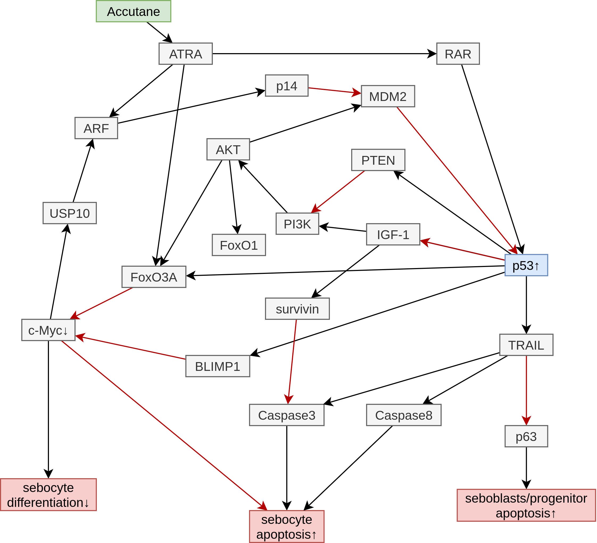

# Accutane 如何预防痤疮？

> 维甲酸预防痤疮主要是通过调节 p53 等物质的表达，以促进皮脂腺细胞凋亡来实现。

#### 相关物质说明

**Accutane，13-顺式维甲酸，异维甲酸**。能被皮脂腺细胞异构化为 ATRA。

**ATRA，全反式维甲酸**：
- 与视黄酸受体（RAR）结合，激活视黄酸受体响应基因（RAR-responsive genes），
  如 TP53（Tumor protein p53），促进 p53 表达；
- 激活转录因子 FoxO3a；
- ARTA 诱导的 ARF 表达促进 p14 表达，从而抑制 MDM2。

**p53** 是一种 53-KDa 核磷蛋白，由 TP53 及 Trp53 基因编码。DNA 损伤和细胞内其他细胞应激发生时，p53 会诱导细胞生长周期停滞或凋亡。[^2]
- p53 诱导 BLIMP1（B-lymphocyte-induced nuclear maturation protein 1，促B淋巴细胞成熟蛋白1） 和 FoxO3 表达，从而抑制 c-Myc，最终导致皮脂腺细胞凋亡；
- p53 在 TRAIL 启动子区域有两个结合位点，可通过促进 TRAIL 表达来促进细胞凋亡。

**TRAIL (tumour necrosis factor-related apoptosis-inducing ligand) 肿瘤坏死因子相关凋亡诱导配体**
- 激活 Caspase（半胱天冬酶，细胞凋亡蛋白酶）8 和 Caspase3，促进细胞凋亡；
- 抑制 p63，导致位于皮脂腺最外层的 seboblasts（皮脂母细胞）/progenitor（祖细胞）数量减少。

**AKT，丝/苏氨酸蛋白激酶，蛋白激酶B**：
- 可通过氧化磷酸化作用抑制 FoxO1 and FoxO3 的活性；
- 可促进 MDM2 的发挥作用。

**MDM2：Mouse double minute 2**：p53 的负调节剂，可与肿瘤抑制因子 p53 结合，通过 p53 的蛋白酶体降解使其失活。[^2]

**ARF（alternate reading frame），p14ARF**：一种抑癌基因编码的蛋白，通过与 MDM2 结合并抑制其功能，阻止其与 p53 结合以间接激活 p53 来抑制异常细胞的生长。

**FoxO3a（Forkhead box O3），FOXO3，FOXO3a**，由 FOXO3 基因编码。
- 可以作为 c-Myc 的拮抗剂[^7]；
- FoxO3a 抑制增加的 IGF-1-AKT 信号传导可能有助于 c-Myc 驱动的皮脂腺细胞分化。

**c-Myc**：一种转录因子，具有多种功能。
- 通过诱导 USP10 的转录提高了 p14ARF 蛋白的稳定性 —— USP10 介导了 p14ARF 的去泛素化，
  从而防止了其依赖蛋白酶体的降解；[^4]
- 通过小鼠实验发现，c-Myc 是促进皮脂腺细胞分化的重要转录因子[^5][^6]；
- c-Myc 减少可导致凋亡，而维持 c-Myc 含量能够减弱 p53 活性，抑制细胞凋亡；[^3]

**泛素特异性蛋白酶10（USP10，Ubiquitin-specific protease 10）**：
p14ARF 去泛素化酶和 p53 的去泛素化酶。[^8]

**Survivin，存活素，凋亡抑制蛋白**：caspase 的一个重要抑制剂。

[^1]: Melnik BC. p53: key conductor of all anti-acne therapies. J Transl Med. 2017 Sep 19;15(1):195. doi: 10.1186/s12967-017-1297-2. PMID: 28927457; PMCID: PMC5606086.
[^2]: Agrawal A, Yang J, Murphy RF, Agrawal DK. Regulation of the p14ARF-Mdm2-p53 pathway: an overview in breast cancer. Exp Mol Pathol. 2006 Oct;81(2):115-22. doi: 10.1016/j.yexmp.2006.07.001. Epub 2006 Aug 17. PMID: 16919268.
[^3]: Thompson EB. The many roles of c-Myc in apoptosis. Annu Rev Physiol. 1998;60:575-600. doi: 10.1146/annurev.physiol.60.1.575. PMID: 9558477.
[^4]: Ko A, Han SY, Choi CH, Cho H, Lee MS, Kim SY, Song JS, Hong KM, Lee HW, Hewitt SM, Chung JY, Song J. Oncogene-induced senescence mediated by c-Myc requires USP10 dependent deubiquitination and stabilization of p14ARF. Cell Death Differ. 2018 Jun;25(6):1050-1062. doi: 10.1038/s41418-018-0072-0. Epub 2018 Feb 22. PMID: 29472714; PMCID: PMC5988833.
[^5]: Arnold I, Watt FM. c-Myc activation in transgenic mouse epidermis results in mobilization of stem cells and differentiation of their progeny. Curr Biol. 2001;11:558–68.
[^6]: Lo Celso C, Berta MA, Braun KM, Frye M, Lyle S, Zouboulis CC, et al. Characterization of bipotential epidermal progenitors derived from human sebaceous gland: contrasting roles of c-Myc and beta-catenin. Stem Cells. 2008;26:1241–52.
[^7]: Peck B, Ferber EC, Schulze A. Antagonism between FOXO and MYC regulates cellular powerhouse. Front Oncol. 2013;3:96.
[^8]: uan J, Luo KT, Zhang LZ, Cheville JC, Lou ZK. USP10 regulates p53 localization and stability by deubiquitinating p53. Cell. 2010;140:384–U121. doi: 10.1016/j.cell.2009.12.032.
