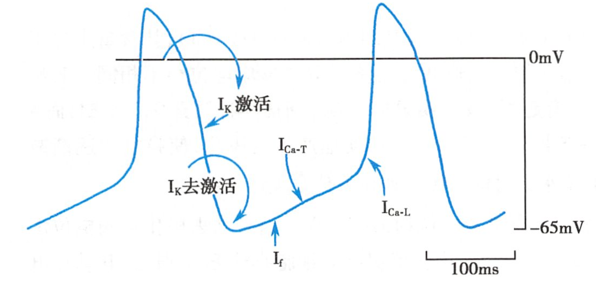

# P细胞 pacemaker cell

- [窦房结](窦房结.md)内的[自律细胞](自律细胞.md)
- [心脏](心脏.md)[自律细胞](自律细胞.md)中[自律性](自律性.md)最高的细胞

## 特点

- [最大复极电位](最大复极电位.md)（$-70mV$）和[阈电位](阈电位.md)（$-40mV$）小于（注意是指负值大小）[浦肯野细胞](浦肯野细胞.md)（$-90mV, -60mV$）
- 0期（[快速去极化期](快速去极化期.md)）[去极化](去极化.md)幅度小（$70\sim85mV$），速度慢（$10V/s$），时程长（$7ms$）
- 无明显复极化1期、2期（[快速复极化初期](快速复极化初期.md)、[平台期](平台期.md)）
- （[窦房结](窦房结.md)能成为[心脏](心脏.md)[正常起搏点](正常起搏点.md)的原因）[4期自动去极化](4期自动去极化.md)（$0.1V/s$）快于[浦氏细胞](浦氏细胞.md)（$0.02V/s$）

## 离子基础

- 0期：ICa-L [L型钙电流](L型钙电流.md)
- 3期：IK [延迟整流钾电流](延迟整流钾电流.md)
- 4期
    - IK [延迟整流钾电流](延迟整流钾电流.md)进行性衰减是窦房结细胞（[P细胞](P细胞.md)）[4期自动去极化](4期自动去极化.md)的主要原因
    - （前半）If [由超极化激活的内向离子电流](由超极化激活的内向离子电流.md)；（后半）ICa-T [T型钙电流](T型钙电流.md)
