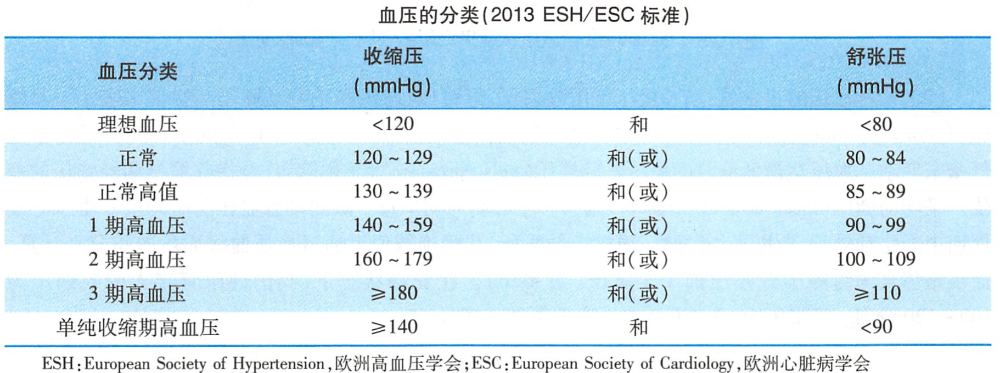

# 动脉血压

- 通常指[主动脉](主动脉.md)[血压](血压.md)
- 正常值
    - [收缩压](收缩压.md)：$100\sim120mmHg$
    - [舒张压](舒张压.md)：$60\sim80mmHg$
    - [脉压](脉压.md)：$30\sim40mmHg$
    - [平均动脉压](平均动脉压.md)

See Also: [高血压](高血压.md)

## 形成条件

1. （前提）[心血管系统](心血管系统.md)有足够的[血液](血液.md)充盈
2. （必要）[心脏](心脏.md)射血
3. [外周阻力](外周阻力.md)
4. [弹性贮器血管](弹性贮器血管.md)（[主动脉](主动脉.md)、大动脉）的弹性贮器作用

## 测量方法

- 直接测量法
- 间接测量法

> <mark style="background-color:#dd4444;">！</mark> 动脉血压存在[节律性变化](节律性变化.md)现象

## 影响因素

1. [心脏](心脏.md)[每搏输出量](每搏输出量.md)
2. [心率](心率.md)
3. [外周阻力](外周阻力.md)
4. [弹性贮器血管](弹性贮器血管.md)（[主动脉](主动脉.md)、大动脉）的弹性贮器作用
5. 循环血量与[心血管系统](心血管系统.md)容量
