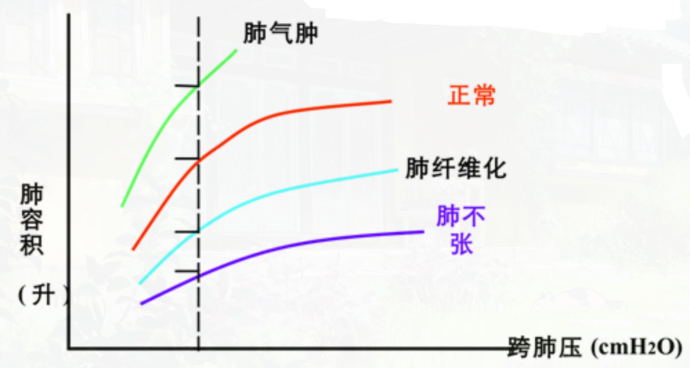

# 弹性阻力 elastic resistance

- 【概念】弹性体对抗外力作用所引起的变形的力
- 【度量】[顺应性](顺应性.md)

## 组成

- [肺弹性阻力](肺弹性阻力.md)
- 胸廓弹性阻力

肺和胸廓的总弹性阻力和总顺应性(正常值)
$$
\frac1{C_{L+chw}}=\frac1{C_L}\frac1{C_{chw}}=\frac1{0.2}\frac1{0.2}=0.1L/cmH_2O
$$

## 生理意义

- 阻碍肺的扩展
- 促进肺的回位

