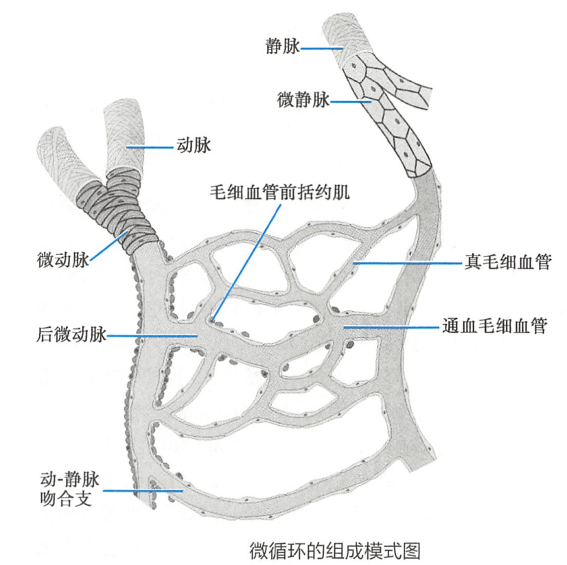

# 微循环 microcirculation

[微动脉](微动脉.md)和[微静脉](微静脉.md)之间的[血液循环](血液循环.md)

## 微循环的组成

- [微动脉](微动脉.md)（总闸门）
- [后微动脉](后微动脉.md)
- [毛细血管前括约肌](毛细血管前括约肌.md)（分闸门）
- [真毛细血管](真毛细血管.md)
- [通血毛细血管](通血毛细血管.md)
- [动-静脉吻合支](动-静脉吻合支.md)
- [微静脉](微静脉.md)

## 微循环的血流通路

1. [迂回通路](迂回通路.md)/[营养通路](营养通路.md)
    - 【功能】物质交换
    - 【特点】轮流开放；开放、关闭交替
2. [直捷通路](直捷通路.md)
    - 【功能】部分[血液](血液.md)迅速回心，调节循环血量
    - 【特点】常开放；交换少；回流快
3. [动-静脉短路](动-静脉短路.md)
    - 【功能】
        - 调节体温；
        - [感染](感染.md)/[中毒性休克](中毒性休克.md)时大量开放，使[血液](血液.md)迅速回心，但可加重组织缺氧
    - 【特点】常开放；不交换；血流快

## 微循环的物质交换方式

1. [扩散](扩散.md)
2. [滤过](滤过.md)、[重吸收](重吸收.md)
3. [吞饮](吞饮.md)
