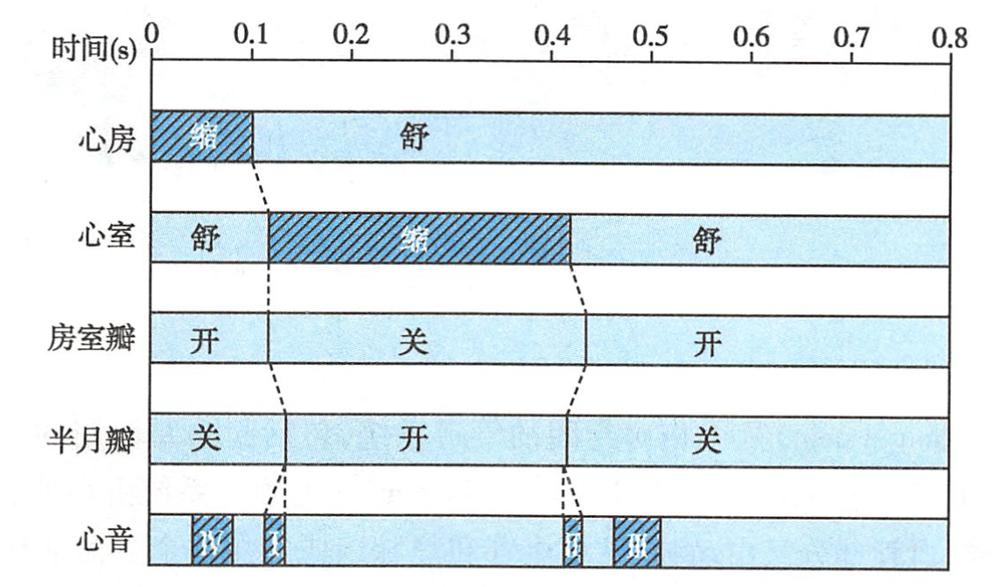
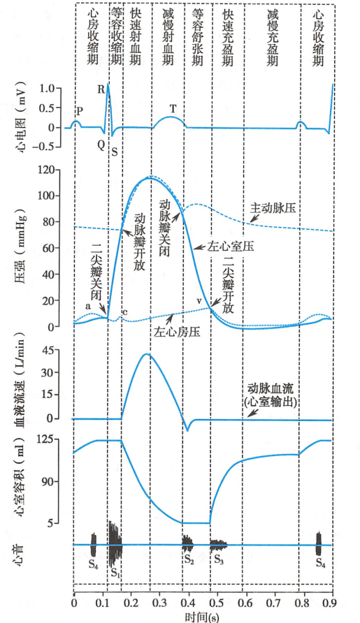
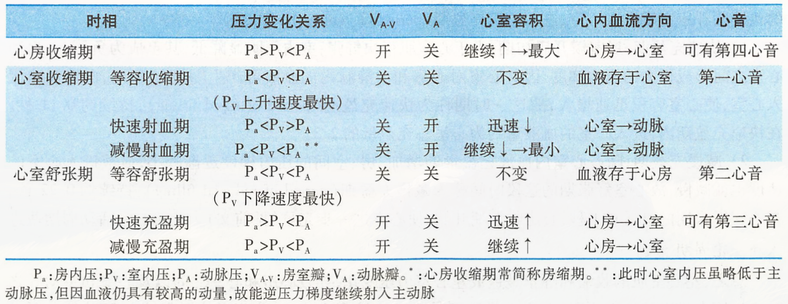

# 心动周期

[心脏](心脏.md)的一次收缩和舒张，构成的一个机械活动周期

> <mark style="background-color:lightgreen;">！</mark> [心室](心室.md)和[心房](心房.md)的机械活动都可分为[收缩期](收缩期.md)和[舒张期](舒张期.md)，
但由于[心室](心室.md)在

See Also: [血液循环](血液循环.md) 

See Also: [心音](心音.md)

- [心房收缩期](心房收缩期.md)
- [心室收缩期](心室收缩期.md)
    - [等容收缩期](等容收缩期.md)：[房室瓣关闭](房室瓣关闭.md)（[第一心音](第一心音.md)）
    - [射血期](射血期.md)
        - [快速射血期](快速射血期.md)：[动脉瓣](动脉瓣.md)开放，[室内压](室内压.md)达到峰值
        - [慢速射血期](慢速射血期.md)：末期[心室](心室.md)容积最小
- [心室舒张期](心室舒张期.md)
    - [等容舒张期](等容舒张期.md)：[动脉瓣](动脉瓣.md)关闭（[第二心音](第二心音.md)）
    - [心室充盈期](心室充盈期.md)
        - [快速充盈期](快速充盈期.md)：[房室瓣](房室瓣.md)开放
        - [慢速充盈期](慢速充盈期.md)：前 0.4s 处于[全心舒张期](全心舒张期.md)，后 0.1s 与[心房收缩期](心房收缩期.md)重叠
