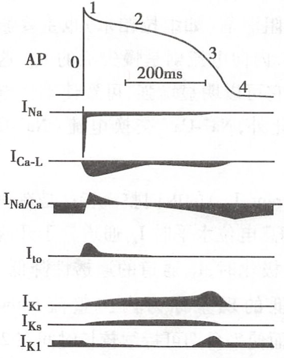
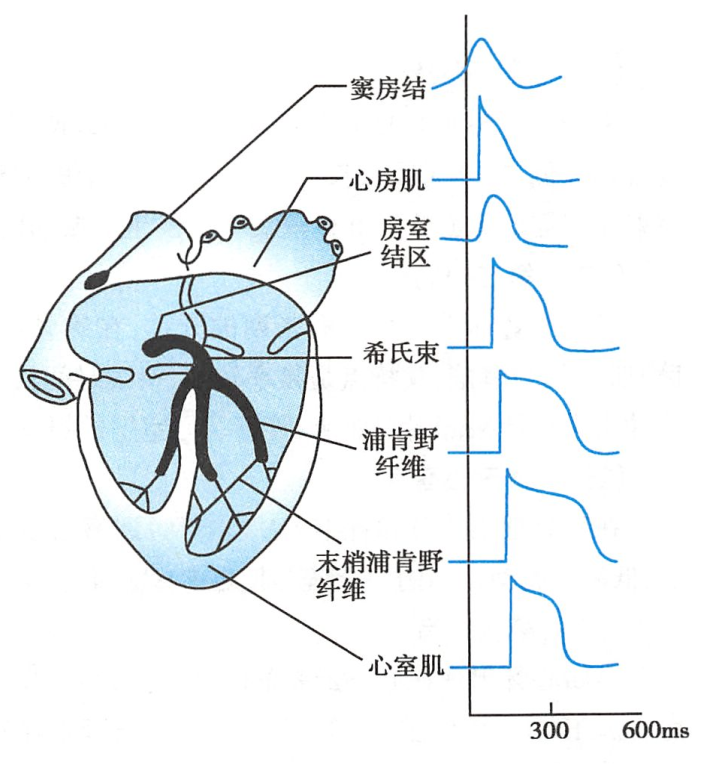
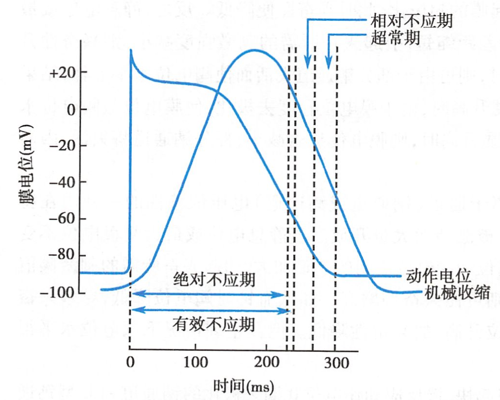
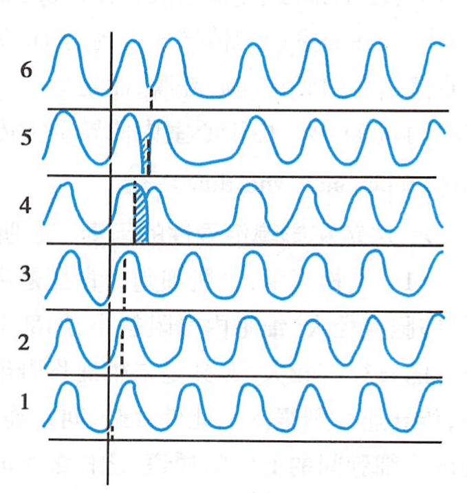

# 心室肌

See Also: [心肌#分类](心肌.md#分类)

## 心室肌细胞跨膜电位

> 基线以下为内向电流，以上则为外向电流 

[动作电位时程](动作电位时程.md)（~~4期~~）：$200\sim300ms$

- INa：Na+ 内流
    - [快钠通道](快钠通道.md)（0）
    - 慢失活的INa（2），[第二平台期](第二平台期.md)
- ICa-L：[L型钙电流](L型钙电流.md)
- INa/Ca/INa-Ca：Na+-Ca+交换体（[钠-钙交换体](钠-钙交换体.md)）
- Ito：[瞬时外向电流](瞬时外向电流.md)
- IK[延迟整流钾电流](延迟整流钾电流.md)
    - IKr
    - IKs
- IK1：[内向整流钾电流](内向整流钾电流.md)：[内向整流钾通道](内向整流钾通道.md)

其他
- Ipump：[泵电流](泵电流.md)
- [钠背景电流](钠背景电流.md)

### 静息电位

- 主要是 K+ 外流形成（<mark style="background-color:lightgreen;">IK1</mark>）
- （-）另有少量<mark style="background-color:lightgreen;">[钠背景电流](钠背景电流.md)</mark>、<mark style="background-color:lightgreen;">[泵电流](泵电流.md)</mark>（[钠泵](钠泵.md)的生电作用）

See Also: [静息电位](静息电位.md)

### 动作电位

- [去极化](去极化.md)：0期：[快速去极化期](快速去极化期.md)
- [复极化](复极化.md)：$200~300ms$
    - 1期：[快速复极化期](快速复极化期.md)
    - 2期：[平台期](平台期.md)：主要特征
    - 3期：[快速复极化末期](快速复极化末期.md)
- 4期：[完全复极化期](完全复极化期.md)/[静息期](静息期.md)

|                      | 0期                        | 1期                 | 2期                                           | 3期                  | 4期                                 |
|----------------------|----------------------------|---------------------|-----------------------------------------------|----------------------|-------------------------------------|
| 主要电流（离子通道） | INa             | Ito      | 内向：ICa-L 外向：IK1K↑       | INa-Ca、Ipump |
| 次要电流             |                            |                     | 慢失活的INa>、IK        | IK1       |                                     |
| 电位变化             | $-90\rightarrow+30mV$      | $+30\rightarrow0mV$ | $0mV$                                         | $0\rightarrow90mV$   | [RP](RP.md)                         |
| 持续时间（ms）       | $1\sim2$                   | $10$                | $100\sim150$                                  | $100\sim150$         |                                     |
| 其他                 | [阈电位](阈电位.md)$-70mV$ |                     |                                               | ICa-L关闭 |                                     |

其他部分的细胞
- [浦肯野细胞#动作电位](浦肯野细胞.md#动作电位)

See Also: [动作电位](动作电位.md) | [心肌#分类](心肌.md#分类)

## 心肌室细胞的兴奋性周期变化

- [有效不应期](有效不应期.md)：
    - [绝对不应期](绝对不应期.md)：0期 -- 3期$-55mV$
    - [局部反应期](局部反应期.md)：3期$-55mV$ -- 3期$-60mV$，给予[阈上刺激](阈上刺激.md)可引起局部反应（[局部电位](局部电位.md)）
- [相对不应期](相对不应期.md)：$\-60mV\rightarrow-80mV$，[兴奋性](兴奋性.md)开始恢复 < 正常
- [超常期](超常期.md)：$\-80mV\rightarrow-90mV$ [兴奋性](兴奋性.md) > 正常

> <mark style="background-color:lightgreen;">！</mark> [心肌](心肌.md)的[有效不应期](有效不应期.md)特别长，是[兴奋性](兴奋性.md)变化的重要特点

[兴奋性](兴奋性.md)周期性变化与收缩活动的关系

心室肌的[有效不应期](有效不应期.md)后，下一次[窦房结](窦房结.md)[兴奋](兴奋.md)到达前，[心室](心室.md)受到外来[刺激](刺激.md)，可提前产生一次[兴奋](兴奋.md)和收缩，分别称为
- [期前兴奋](期前兴奋.md)
- [期前收缩](期前收缩.md)

[代偿间歇](代偿间歇.md)：在[期前收缩](期前收缩.md)后往往会出现的一段较长的[心室舒张期](心室舒张期.md)
