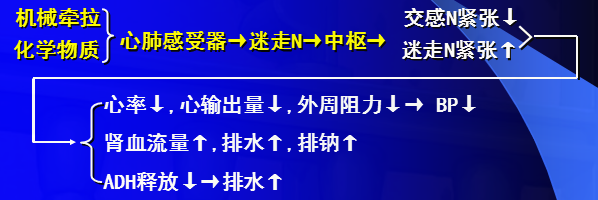

# 心肺感受器

一些位于[心房](心房.md)、[心室](心室.md)、[肺循环](肺循环.md)大血管壁内的感受器

Same: [容量感受器](容量感受器.md)
See Also: [心血管反射](心血管反射.md)

- （[容量感受性反射](容量感受性反射.md)）[机械牵张刺激](机械牵张刺激.md) -> [迷走神经](迷走神经.md)
- [前列腺素](前列腺素.md)、[腺苷](腺苷.md)、[缓激肽](缓激肽.md) -> [交感神经](交感神经.md)
