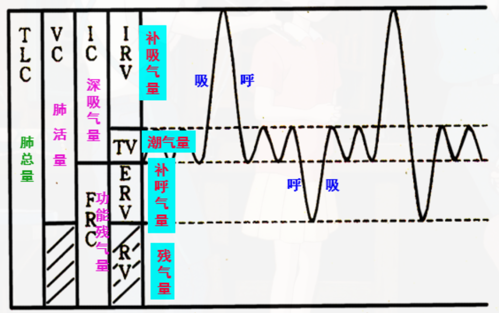

# 肺容量 pulmonary capacity

[肺容积](肺容积.md)中两项或两项以上的联合气体量

1. [深吸气量](深吸气量.md)：[平静呼吸](平静呼吸.md)呼气末做最大吸气时所能吸人的气体量
2. [功能余气量](功能余气量.md)：[平静呼吸](平静呼吸.md)呼气未尚存留于[肺](肺.md)内的气体量
3. [肺活量](肺活量.md)、[用力肺活量](用力肺活量.md)、[用力呼气量](用力呼气量.md)
    1. [肺活量](肺活量.md)：尽力吸气后，从肺内所能呼出的最大气体量
    2. [用力肺活量](用力肺活量.md)：一次最大吸气后，尽力尽快呼气所能呼出的最大气体量
    3. [用力呼气量](用力呼气量.md)：最大吸气后尽力尽快呼气，在一定时间内所能呼出的气体量
4. [肺总量](肺总量.md)：[肺](肺.md)所能容纳的最大气体量

[哮喘](哮喘.md)等[阻塞性肺疾病](阻塞性肺疾病.md)
- [FEV](FEV.md)，的降低比[FVC](FVC.md)更明显 => [FEV](FEV.md)/[FVC](FVC.md)变小 => 要呼出相当于 FVC 的气体量往往需要较长的时间
- [余气量](余气量.md)增大

[肺纤维化](肺纤维化.md)等[限制性肺疾病](限制性肺疾病.md)患者
- [FEV](FEV.md)、[FVC](FVC.md)均下降，但[FEV](FEV.md)/[FVC](FVC.md)仍可基本正常
- [余气量](余气量.md)减少

