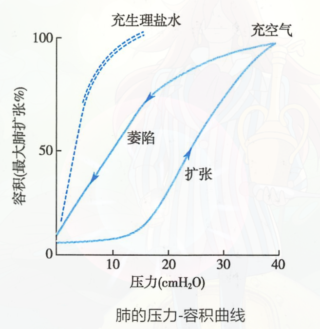

# 肺弹性阻力

See Also: [弹性阻力](弹性阻力.md)

肺弹性阻力可用[肺顺应性](肺顺应性.md)表示

## 来源

- 【1/3】[肺](肺.md)的弹性成分
    - [弹力纤维](弹力纤维.md)
    - [胶原纤维](胶原纤维.md)
- 【2/3】**[肺泡](肺泡.md)[表面张力](表面张力.md)**

根据[Laplace定律](Laplace定律.md)即
$$
P=\frac{2T}{r}
$$

- P：为肺泡内液-气界面的压强(N/m2)，可引起[肺泡](肺泡.md)回缩
- T：为肺泡内液-气界面的表面[张力系数](张力系数.md)，即单位长度的表面张力(N/m2)
- r：为[肺泡](肺泡.md)半径(m)

[肺表面活性物质](肺表面活性物质.md)

[滞后现象](滞后现象.md)
- （由图中可看出，）向[肺](肺.md)注人与抽出气体时的肺顺应性曲线并不重叠
- 产生主要与[肺泡](肺泡.md)[表面张力](表面张力.md)有关
